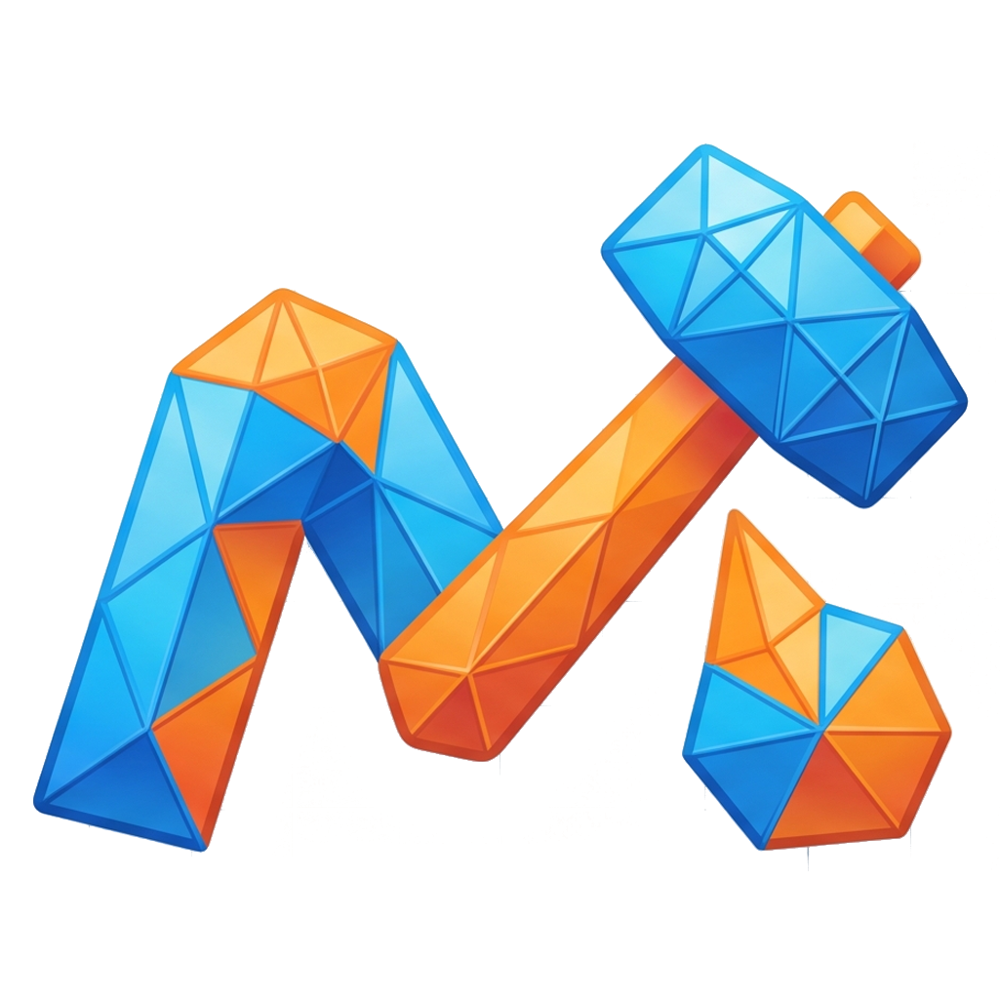

<div align="center">
  

  <h1>MeshySmith</h1>

  <p><strong>A local-first 3D design editor that runs in your browser, in Electron, or behind nginx.</strong></p>

  <p>Drag a primitive, dial in dimensions, fillet an edge, cut a hole, group it, export an STL. No login, no cloud lock-in, no heavyweight CAD install.</p>

  <p>
    <a href="LICENSE"></a>
    <a href="https://github.com/f00d4tehg0dz/MeshySmith-3D/actions/workflows/ci.yml"></a>
  </p>
</div>

---

## Table of contents

- [Why MeshySmith](#why-meshysmith)
- [Features](#features)
- [Demo](#demo)
- [Quick start](#quick-start)
- [Desktop app (Electron)](#desktop-app-electron)
- [Docker / FabLab server](#docker--fablab-server)
- [Architecture](#architecture)
- [Testing](#testing)
- [Project status](#project-status)
- [Contributing](#contributing)
- [Security](#security)
- [License](#license)

## Why MeshySmith

CAD tools are powerful but heavy. Web modellers are quick but cloud-locked.

MeshySmith targets the middle: the satisfying loop of **drop, resize, rotate, hole, group, export** with everything stored in your browser's local storage. Designs never leave your machine unless you export an STL or OBJ yourself.

It's built for makers, fab labs, classrooms, and anyone who wants a fast 3D sketch surface without a Tinkercad account or a Fusion subscription.

## Features

### Modelling

- **16 primitives** across five categories — Basic (Box, Cylinder, Sphere, Cone, Pyramid, Wedge), Curved (Round Roof, Half Sphere, Torus, Tube, Capsule), Polyhedra (Octahedron, Dodecahedron), Mechanical (Torus Knot, Gear), and Type (Text)
- **Fillet and chamfer** on box edges with a smoothness control
- **Solid / hole workflow** with boolean grouping powered by [Manifold](https://github.com/elalish/manifold)
- **Group / ungroup**, **align**, **mirror**, **boolean intersection**
- **STL import** for shapes you can't build from primitives, plus STL and OBJ export
- **Snap to grid** with adjustable spacing and a ruler tool

### Viewport

- **ViewCube** with 26 click zones (faces, edges, corners) and drag-to-orbit, like Fusion 360
- **Perspective ↔ orthographic** camera toggle
- **Smooth fly-to-view** animation that respects orbit limits
- **Fit to view**, **home view**, zoom buttons, and themed grid
- **Drag-from-outliner-to-workplane** to clone existing shapes

### Editor UX

- **Categorised shape palette** with keyword search
- **Scene outliner** with eye/lock toggles, inline rename, drag-to-clone, and right-click context menu
- **Right-click context menu** in the viewport too (with drag suppression so right-drag-orbit still works)
- **Light / dark / system theme** with a clean switch and a true-orthographic-looking dark grid
- **Onboarding tour** on first run, replayable from Tips
- **Keyboard shortcuts** for everything that matters (Ctrl+Z/Y/C/X/V/D/A/G/L/H, arrow nudges, F for fit, +/- for zoom)

### Persistence and delivery

- **Local-first project storage** in IndexedDB, with thumbnails written to `.meshysmith/project-thumbnails` in dev mode
- **Three ship targets**: Next.js dev server, static export via Docker + nginx, and a native Electron desktop app for Windows / macOS / Linux
- **Full icon pipeline** — one logo PNG generates favicon.ico (multi-resolution), Electron `.ico` / `.png` for Windows / Linux, and an Apple touch icon

## Demo

> Coming soon. Run it locally in 30 seconds — see [Quick start](#quick-start).

## Quick start

Requirements:

- Node.js 20 or newer
- npm 10+

```bash
git clone https://github.com/f00d4tehg0dz/MeshySmith-3D.git
cd MeshySmith-3D
npm install
npm run dev
```

Open <http://127.0.0.1:3000/>.

If you ever see a stale `/` 404 after pulling major changes, wipe the dev cache and restart:

```bash
npm run dev:clean
```

## Desktop app (Electron)

MeshySmith ships as a native desktop app on Windows, macOS, and Linux. The Electron shell loads the same static export the Docker image uses — projects stay in the desktop app's local storage, no server is involved.

```bash
npm install
npm run electron:dev     # build the static export, then launch the Electron window
```

Build installers:

```bash
npm run electron:dist        # current platform
npm run electron:dist:win    # Windows NSIS installer
npm run electron:dist:mac    # macOS DMG (universal x64 + arm64)
npm run electron:dist:linux  # Linux AppImage
```

Output lands in `deploy/electron/dist/`. The Windows installer uses a multi-resolution `.ico`, taskbar / window title icon use the same artwork, and the app is grouped under the `dev.f00d4tehg0dz.meshysmith` AppUserModelId so it pins cleanly to the taskbar.

See [`deploy/electron/README.md`](deploy/electron/README.md) for details. If `ELECTRON_RUN_AS_NODE` is set in your shell, unset it before launching.

## Docker / FabLab server

The Docker image is a static MeshySmith build served by nginx. Projects stay in each user's browser; STL and OBJ files download through that browser. The container itself never receives or stores project files.

Recommended for fab labs, classrooms, and shared workstations because it bundles the correct Node build environment, the static app, the nginx config, a health check, and the restart policy.

```bash
npm run docker:up
```

Open <http://127.0.0.1:3000/> on the host. Machines on the LAN can use the server's IP. To change the host port:

```bash
MESHYSMITH_PORT=8080 npm run docker:up              # bash / zsh
$env:MESHYSMITH_PORT = "8080"; npm run docker:up    # PowerShell
```

Stop:

```bash
npm run docker:down
```

## Architecture

```
apps/web/                  Next.js 16 App Router workspace
  src/app/                 Routes (page.tsx, layout.tsx, /api/*)
  src/components/          Editor, workplane viewport, theme, onboarding, outliner
  src/lib/                 Pure logic (shape catalog, exports, settings)
  src/types/               Shared TypeScript types
  public/assets/meshysmith Brand and shape thumbnails
deploy/
  docker/                  Nginx-served static build
  electron/                Electron main + electron-builder config + icons
scripts/
  generate-icons.mjs       Master-logo → favicon.ico, Electron icons
tests/
  unit/                    Vitest unit tests
  e2e/                     Playwright end-to-end tests
  perf/                    STL import benchmarks
```

Tech stack:

- [Next.js 16](https://nextjs.org/) (App Router, Turbopack)
- [React 19](https://react.dev/)
- [TypeScript](https://www.typescriptlang.org/)
- [Three.js](https://threejs.org/) for the workplane viewport
- [Manifold](https://github.com/elalish/manifold) for booleans
- [three-bvh-csg](https://github.com/gkjohnson/three-bvh-csg) for CSG preview
- [Tailwind CSS v4](https://tailwindcss.com/) and CSS custom properties for theming
- [Electron 42](https://www.electronjs.org/) for the desktop shell
- [Playwright](https://playwright.dev/) + [Vitest](https://vitest.dev/) for testing

## Testing

```bash
npm run typecheck        # tsc --noEmit
npm test                 # Vitest unit tests
npm run test:e2e         # Playwright end-to-end (spins up a dev server)
npm run test:e2e:headed  # same, with a visible browser
```

CI runs typecheck, unit, build, static export, and the full Playwright suite on every push and pull request to `main`. See [`.github/workflows/ci.yml`](.github/workflows/ci.yml).

## Project status

MeshySmith is **alpha**. The core editor loop is usable today:

- Add and edit primitives
- Fillet / chamfer boxes
- Drag, rotate, mirror, align, group, intersect
- Apply solid / hole boolean ops
- Import STL, export STL or OBJ
- Theme switch, ViewCube, ortho mode
- Local project persistence with thumbnails

Roadmap candidates (open an issue if you want to drive one):

- More mechanical primitives (helical spring, rack, sprocket)
- Direct mesh editing (vertex / edge / face manipulation)
- Native `.icns` for macOS and proper retina icon support
- Cloud-optional collaboration (the local-first invariant stays)
- Plugin API for custom shape generators

## Contributing

Issues and pull requests welcome. Please read [`CONTRIBUTING.md`](.github/CONTRIBUTING.md) before you start — it covers branching, testing, and the areas of the codebase that need extra care.

The community follows the [Contributor Covenant 2.1](.github/CODE_OF_CONDUCT.md).

## Security

Found a vulnerability? Please **don't** open a public issue. Use the [private security advisory flow](https://github.com/f00d4tehg0dz/MeshySmith-3D/security/advisories/new). Full disclosure policy in [`SECURITY.md`](.github/SECURITY.md).

## License

Copyright © f00d4tehg0dz and MeshySmith contributors.

MeshySmith is distributed under the [GNU Affero General Public License v3.0 or later](LICENSE). If you modify MeshySmith and let users interact with it over a network, you must offer them the corresponding source.
